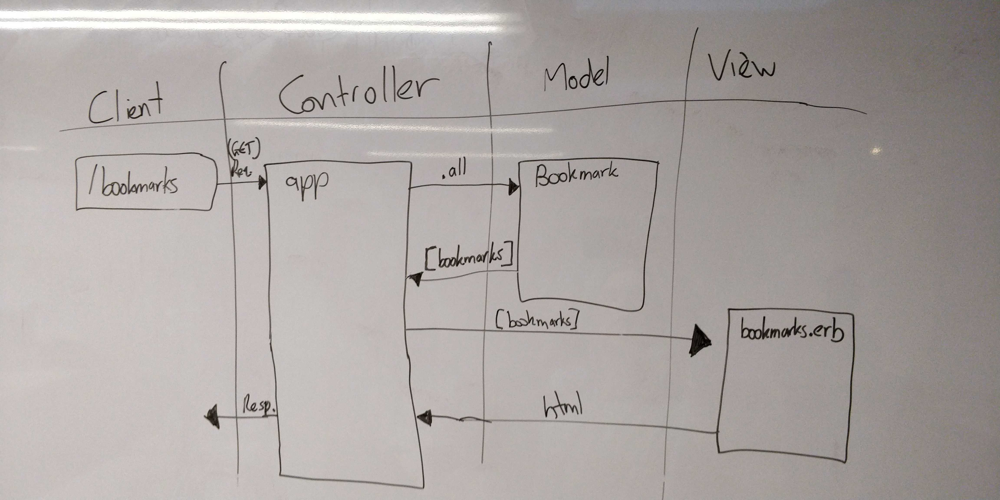

# Bookmark Manager App

Alex's Domain Model for User Story 1:



Habakkuk's Domain Model for User Story 1:


Database Setup Instructions:
----

1. Connect to psql and create a database.

```
CREATE DATABASE bookmark_manager;
```

2. Connect to the new database.
3. Run the SQL commands in `db/migrations` to create the table.
